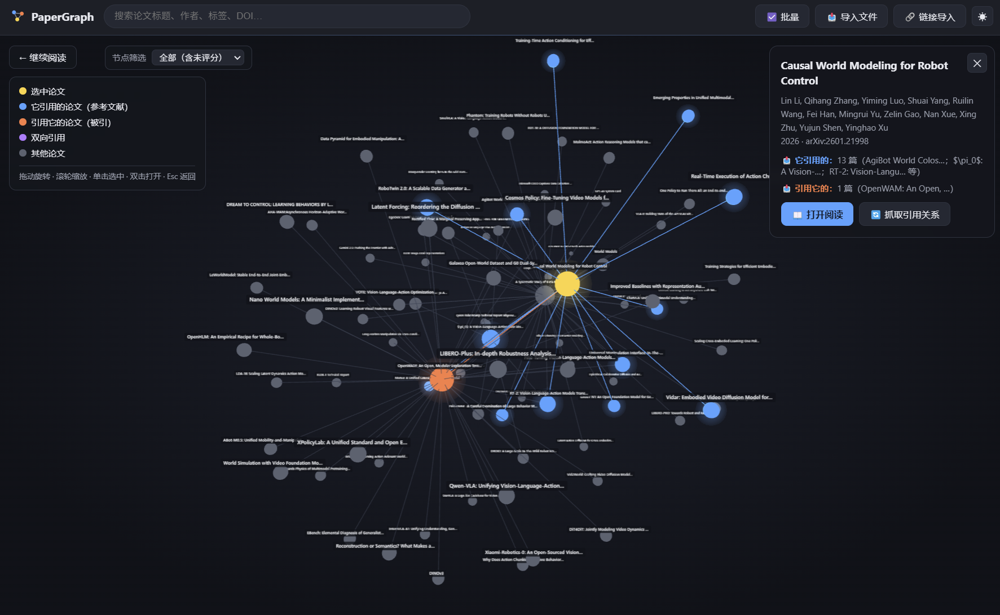
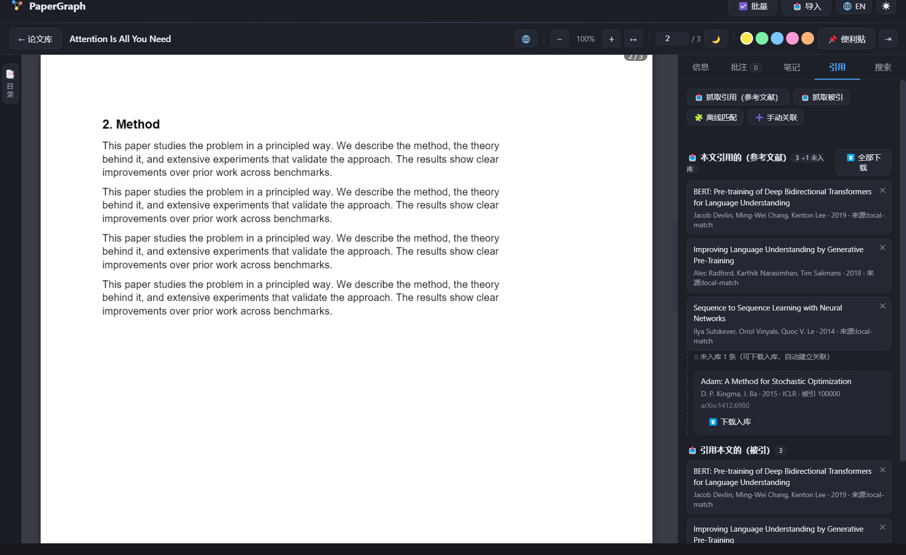
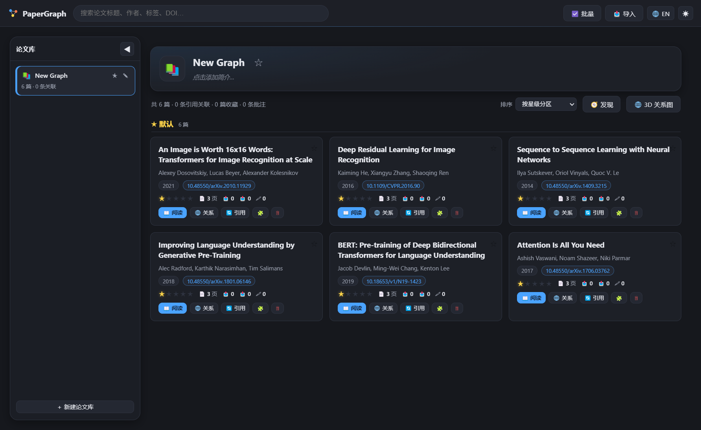
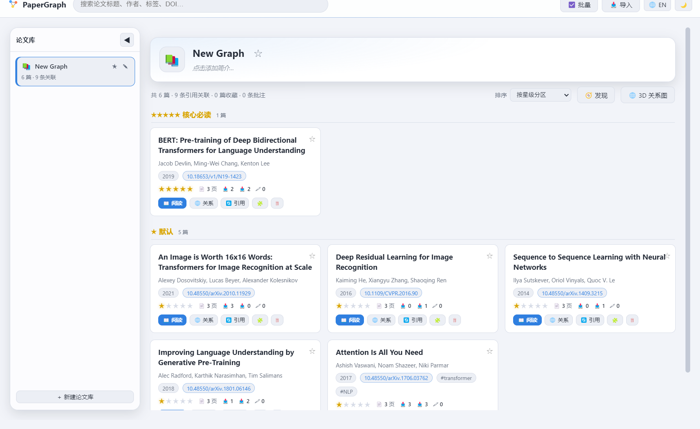
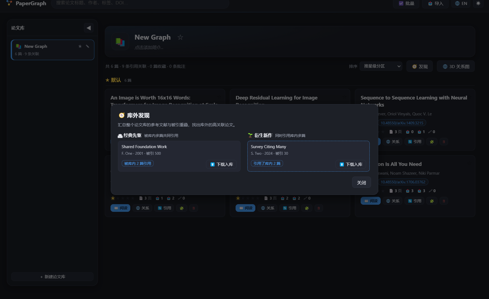

<div align="center">


# PaperWeave

**轻量、跨平台的桌面论文阅读器：阅读、批注、评星，并把论文库织成一张可探索的 3D 引用网络。**

[English](README.en.md) | 中文

[](https://github.com/webDrag0n/PaperWeave/releases/latest)
[](https://github.com/webDrag0n/PaperWeave/actions/workflows/ci.yml)
[](LICENSE)
[](#-下载)
[](package.json)



[下载](#-下载) · [快速开始](#-快速开始) · [功能亮点](#-功能亮点) · [Agent 集成](#-agent-集成) · [开发文档](#-开发)

</div>

---

## 📖 目录

- [简介](#-简介)
- [功能亮点](#-功能亮点)
- [下载](#-下载)
- [快速开始](#-快速开始)
- [典型工作流](#-典型工作流)
- [Agent 集成](#-agent-集成)
- [数据与隐私](#-数据与隐私)
- [常见问题](#-常见问题)
- [开发](#-开发)
- [路线图](#-路线图)
- [贡献](#-贡献)
- [许可证](#-许可证)

## 💡 简介

PaperWeave 是为「读论文 + 理脉络」而生的桌面工具：它不只是一个 PDF 阅读器——导入论文后会自动解析引用关系，把论文库织成一张可交互的 3D 引用网络；遇到未收录进库的参考文献，可以一键下载入库并自动挂到网络里。

同一套源码编译 Windows / macOS / Linux 三平台产物；纯 ES Module 前端无构建步骤，Agent 可通过本地 HTTP API 或 MCP Server 全权接管论文库。

## ✨ 功能亮点

### 📄 阅读与批注

- **PDF 阅读**：多页渲染、长文档懒加载秒开、以鼠标位置为中心的 Ctrl+滚轮平滑缩放、↔ 适应宽度、← → 翻页、文本选择复制
- **目录侧边栏**：左侧窄条展开半透明目录面板，点击条目**精确定位到子段落标题处**（大纲 dest 坐标 + 标题文本行双重定位）
- **高亮批注**：选中文字弹出工具条，5 色高亮 + 文字批注；高亮与搜索命中作为文字背景，不遮挡或改变文字颜色；「📌 便利贴」可在页面任意位置放置便签
- **正文引用悬浮卡片**：鼠标悬停正文里的 `[1]` 或作者—年份引用，直接显示对应参考文献；库内论文可一键打开，未入库条目可直接下载
- **论文笔记**：每篇论文支持 Markdown 笔记，编辑 / 预览切换，自动保存
- **阅读体验**：自动记忆每篇阅读位置并在重开时恢复；右侧面板一键收起专注阅读；🌙 护眼模式；☀️ 浅色 / 深色主题（3D 图谱配色联动）；🔤 界面中英双语切换（顶栏按钮，偏好持久化）



### ⭐ 论文库管理

- **多论文库**：左侧论文库面板（可展开/缩回）以卡片管理多个论文库——卡片显示名称与简介（点击 ✎ 直接编辑）、★ 星标置顶、拖动排序、删除需输入完整名称确认；默认初始库名称为 `New Weave`
- **全部已下载**：独立于任何论文库查看全局论文与跨库关系，删除论文库后仍能找到未加入其他库的论文；在此视图删除会全局清除论文
- **可配置存储目录**：「⚙ 设置」分别选择 PDF 下载目录与数据目录；现有文件复制且原目录保留，PDF 目录立即生效，数据目录重启后生效
- **统一导入**：一个「📥 导入」弹窗同时支持粘贴链接（PDF 直链 / arXiv）、拖入文件、点击打开文件管理器多选；多链接自适应并行下载，实时显示完成数、等待数与当前并发
- **统一论文存储**：同一篇论文全局仅存一份（唯一 id 跨库复用），论文库只记录包含哪些论文及库内引用关联
- **智能去重**：导入时内容 hash 命中直接复用；DOI 相同（可能不同版本）或标题高度相似时**弹窗请你确认**——复用已有论文或作为新论文导入
- **自动元数据**：标题 / 作者 / DOI / 摘要 / 参考文献段落自动提取；发表年份优先采用 arXiv 编号与明确出版标记，避免正文数字误判
- **重要性评星**：1–5 星卡片上直接点星；手动导入默认 1 星，引用自动下载的文献默认未评分
- **星级分区与排序**：默认按星级分区（★★★★★ → ☆ 未评分），可切换最新添加 / 年份 / 标题 / 引用关联数排序
- 搜索、标签、收藏、批量管理一应俱全；**标题支持行内 Markdown**（`**粗**`、`*斜*`、`` `代码` ``、`~~删~~`）




### 🌐 引用关系图与时间线

- 力导向 3D 图谱，全部论文标签常显，节点辉光，相机平滑过渡
- **跳数高亮滑条**（1–5，默认 2）：🟡 选中论文，N 跳邻居按跳数分色（蓝/橙/紫/绿/粉），跳数外置灰
- **Shift+点击多选**：网络视图勾勒多篇论文之间的最短关联；时间线视图高亮选中论文之间的全部引用路径（不覆盖跳数颜色）
- **二维时间线视图**：按发表年份排布，未知年份独立成列；滚轮整体缩放，Shift 横向缩放，Ctrl 纵向缩放
- **上下游发展史**：对单篇论文递归展示参考文献与被引脉络，并排除旁支
- 图谱多维筛选支持星级与作者组合；作者可多选，也可点击论文详情中的作者直接切换筛选。从论文库 / 阅读器 / 卡片进入，退出时原路返回
- 拖动旋转 · 滚轮缩放 · 单击选中 · 双击打开阅读

### 🔗 引用关系引擎

- **导入即解析**：任何论文入库后自动后台解析引用关系，不打断当前操作；阅读器与 3D 节点侧栏同步显示抓取进度，往返视图后仍在运行的任务进度不会丢失
- **抓取引用（参考文献）**：优先 Semantic Scholar 结构化参考文献（分页拉取，最准最全）；未收录时回退解析 PDF 参考文献段落（支持 `[1]` / `1.` / `[Vaswani+17]` / 无编号列表、机构作者、跨行断词与附录截断，自动去重），逐条经 DOI（CrossRef）/ arXiv / S2 标题匹配 / OpenAlex 检索确认
- **抓取被引**：Semantic Scholar（限流退避），失败自动回退 OpenAlex 分页处理
- **未入库引用闭环**：识别成功但不在库内的条目持久保存在「引用」面板，支持**单篇下载入库或一键自适应并行全部下载**（arXiv / OpenAlex 开放获取），入库自动建边并出现在图谱中，后台下载不影响阅读；无 OA 或下载失败的论文集中在顶部可展开列表显示原因并可重试
- 🧩 离线模糊匹配（无需网络）与 ➕ 手动关联兜底

### 🧭 相似与库外发现

- **相似论文**：基于文献计量学的文献耦合（共同参考文献）× 同被引（共同引用者）计算库内相似度，选中论文后在详情栏给出 Top 5 相似论文与重叠度百分比，点击即跳转
- **库外发现**：论文库工具条「🧭 发现」汇总全库的参考文献与被引重叠——「🏛 经典先驱」列出被库内多篇共同引用却未入库的奠基论文，「🌱 衍生新作」列出同时引用库内多篇的新论文，均可一键下载入库



### 🧩 浏览器插件

PaperWeave Connector（Chrome / Edge）在 arXiv、PDF 页面与带 `citation_*` 元数据的出版商页面上一键把论文保存到桌面端，可选择目标论文库，也支持右键保存。插件自动发现并连接本机正在运行的 PaperWeave。安装与使用见 [`extension/README.md`](extension/README.md)。

## 📦 下载

预构建版本发布在 [GitHub Releases](https://github.com/webDrag0n/PaperWeave/releases/latest)：

| 文件 | 说明 |
| --- | --- |
| `PaperWeave-<版本>-win-x64-setup.exe` | Windows 安装程序（可选安装目录） |
| `PaperWeave-<版本>-win-x64-portable.exe` | Windows 便携版，免安装直接运行 |
| `PaperWeave-Connector-<版本>.zip` | Chrome / Edge 浏览器插件 |

- Windows 安装包没有代码签名，首次运行时 SmartScreen 会提示，选择「更多信息 → 仍要运行」。
- macOS 与 Linux 暂不提供预构建包，请[从源码构建](#-开发)。
- 各版本的变化见 [CHANGELOG.md](CHANGELOG.md) 与 [`docs/releases/`](docs/releases/)。

## 🚀 快速开始

### 使用预构建版本

1. 下载并运行安装包或便携版
2. 把 PDF 拖进窗口，或点「📥 导入」粘贴 arXiv 链接
3. 打开论文阅读，点「🌐」进入引用关系图

### 从源码运行

需要 Node.js 18 或更高版本。

```bash
git clone https://github.com/webDrag0n/PaperWeave.git && cd PaperWeave
npm install          # 安装依赖（Electron、pdf.js、three.js）
npm start            # 启动桌面应用
npm run dev          # 浏览器预览模式（http://localhost:7100/，示例数据自动载入）
```

## 🧭 典型工作流

1. **建库**：拖入一批 PDF（或粘贴 arXiv 链接），元数据与引用关系自动就位
2. **精读**：目录侧边栏跳段落 → 高亮核心句 → 便利贴记录疑问 → Markdown 笔记总结
3. **理脉络**：卡片「关系」进入图谱 → 滑条看 2 跳引用圈 → 时间线 Shift 多选几篇核心论文看全部引用路径 → 未入库的高被引参考文献一键下载补库
4. **分级**：读完点星，论文库按星级自动分区，图谱按星级过滤只看核心网络

## 🤖 Agent 集成

PaperWeave 提供两种 Agent 接入方式，完整契约与版本历史见 [`agents/AGENTS.md`](agents/AGENTS.md)：

- **本地 HTTP Agent API**（`127.0.0.1:24680`，`X-PaperWeave-Token` 令牌鉴权）：论文库管理、导入、批注、笔记、引用抓取与下载、图谱读取、实时进度查询
- **MCP stdio Server**（`mcp/paperweave-mcp.js`，零依赖单文件）：Claude Desktop / Cursor / Kimi 等宿主配置 `node paperweave-mcp.js` 即可接入；工具与 HTTP API 一一对应，另有 Resources 与 Prompt 工作流模板（精读 / 综述 / 导入建联）

```jsonc
// MCP 宿主配置示例
{
  "mcpServers": {
    "paperweave": { "command": "node", "args": ["<paperweave-mcp.js 的绝对路径>"] }
  }
}
```

连接信息（端口 + 令牌）在启动后写入 `paperweave-data/agent-api.json`；便携版同时写入 exe 同目录，并自动复制 `AGENTS.md` 与 `paperweave-mcp.js`。

> 仓库里有两份 `AGENTS.md`：[`agents/AGENTS.md`](agents/AGENTS.md) 写给**使用** PaperWeave 的 Agent，随安装包分发；根目录的 [`AGENTS.md`](AGENTS.md) 写给**修改本仓库代码**的 Agent。

## 🗂 数据与隐私

- **完全本地优先**：论文库、批注、笔记、评星全部存储在本机，无任何遥测与云端上传
- 桌面版数据位于用户数据目录 `paperweave/paperweave-data/`：
  - `data.json` 应用级配置与论文库列表；`papers.json` 全局论文注册表；`annotations.json` 批注
  - `libraries/<id>.json` 每个论文库的论文清单与引用关联；`library/` 全局共享 PDF 文件库（内容 hash 命名）
  - Windows 示例：`C:\Users\<你>\AppData\Roaming\paperweave\paperweave-data\`
  - macOS：`~/Library/Application Support/paperweave/paperweave-data/`
  - Linux：`~/.config/paperweave/paperweave-data/`
- 浏览器预览版使用 localStorage + IndexedDB
- 引用抓取仅访问公开学术 API（Semantic Scholar / OpenAlex / CrossRef / arXiv）
- Agent API 只监听本机回环地址。安全模型、已知限制与漏洞报告方式见 [SECURITY.md](SECURITY.md)

## ❓ 常见问题

**抓取引用时被限流 / 失败？**
Semantic Scholar 未认证配额为共享池（约 1 req/s），高峰期可能 429。应用已内置节流与指数退避，并自动回退 OpenAlex；如需稳定高配额，设置环境变量 `PAPERWEAVE_S2_API_KEY=<你的 S2 API Key>` 后启动（免费申请见 Semantic Scholar 官网）。

**不希望导入后自动解析引用？**
设置 `PAPERWEAVE_AUTOFETCH=0` 后启动即可关闭，仍可在「引用」页签手动抓取。

**引用下载失败？**
下载走 arXiv 直链与 OpenAlex 开放获取（OA）位置；无 OA 来源的付费论文会集中在「引用」页顶部显示失败原因，可逐条重试，也可手动下载后导入，再点「已在库中 · 关联」补建引用边。

**macOS / Linux 安装包？**
macOS 在 macOS 上执行 `./tools/build-mac.sh`（或 `npm run dist:mac`）；Linux 的 AppImage / deb 在 Linux 上执行 `npm run dist:linux`。没有 Apple 开发者证书时产物为 ad-hoc 签名，本机可直接运行，其他 Mac 需在「系统设置 → 隐私与安全性」中放行。

## 🛠 开发

前端是纯 ES Module，没有构建步骤；主进程是 CommonJS；运行时依赖只有 pdf.js 与 three.js。

```bash
npm start            # 桌面应用
npm run dev          # 浏览器预览
npm test             # 快速回归：纯 Node，不启动 Electron
npm run test:e2e     # 完整回归：启动 Electron，其中 selftest 会弹出窗口并占用焦点
npm run dist:win     # 构建 Windows 安装包与便携版（dist:mac / dist:linux 同理）
```

| 文档 | 内容 |
| --- | --- |
| [docs/architecture.md](docs/architecture.md) | 架构、模块职责、数据模型、核心流程、安全边界、设计决策与已知限制 |
| [docs/development.md](docs/development.md) | 环境准备、命令、代码约定、各类改动的检查清单 |
| [docs/testing.md](docs/testing.md) | 各测试套件的范围、运行条件与 CI |
| [docs/releasing.md](docs/releasing.md) | 版本号规则与发布步骤 |
| [agents/AGENTS.md](agents/AGENTS.md) | Agent HTTP API 与 MCP 契约 |
| [AGENTS.md](AGENTS.md) | 写给 coding agent 的仓库工作规则 |
| [CHANGELOG.md](CHANGELOG.md) | 版本变更记录 |

完整索引见 [docs/README.md](docs/README.md)。

## 🗺 路线图

- [x] 引用网络时间线视图（按发表年份排布）
- [ ] macOS 签名与公证构建
- [ ] 高亮与笔记导出为 Markdown / BibTeX
- [ ] Zotero 库导入
- [ ] 跨库全文搜索
- [ ] S2 API Key 设置界面

## 🤝 贡献

欢迎 Issue 与 PR，中英文均可。流程、提交规范与合并前检查见 [CONTRIBUTING.md](CONTRIBUTING.md)；安全问题请按 [SECURITY.md](SECURITY.md) 私下报告。

提交代码前至少运行 `npm test`；改动涉及界面、IPC、Agent API 或存储时再运行 `npm run test:e2e`。接口、数据字段或行为语义有变化时，必须同步更新 `agents/AGENTS.md` 并递增 API 版本号。

## 📄 许可证

[MIT](LICENSE) © PaperWeave contributors
